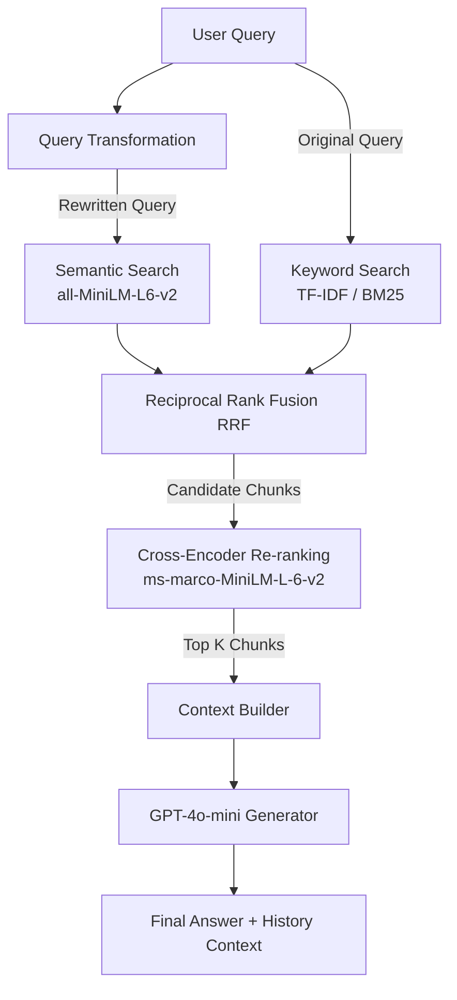

# 🚀 Advanced RAG System

An end-to-end, production-grade **Retrieval-Augmented Generation (RAG)** pipeline designed with a modular architecture, featuring Hybrid Search, Query Transformation, Reciprocal Rank Fusion (RRF), Cross-Encoder Re-ranking, and an interactive Streamlit UI.

---

## 📐 System Architecture

The workflow follows a advanced RAG retrieve-and-rank blueprint to maximize document relevance and context extraction:



1. **Query Transformation**: Takes a vague/imperfect user query and rewrites it using `gpt-4o-mini` to be clearer and optimized for vector/keyword retrieval.
2. **Hybrid Search**: Retrieves document chunks using two parallel approaches:
   - **Semantic Search**: Dense vector matching with ChromaDB + `sentence-transformers/all-MiniLM-L6-v2`.
   - **Keyword Search**: Sparse text matching using custom `TfidfVectorizer` (capturing bigrams, removing English stop words).
3. **Reciprocal Rank Fusion (RRF)**: Merges sparse and dense search results using the RRF algorithm, which scores document chunks based on their positions in both retrieval lists.
4. **Cross-Encoder Re-ranking**: Evaluates the retrieved candidates against the query using a deep learning Cross-Encoder model (`cross-encoder/ms-marco-MiniLM-L-6-v2`) to compute exact relevance scores, returning the most contextually relevant top-K chunks.
5. **Context Generation**: Injects the re-ranked chunks and the last 3 turns of conversation history into the generation prompt for `gpt-4o-mini`.

---

## ✨ Key Features

- **📂 Persistent Vector Database**: Uses **ChromaDB** configured with `PersistentClient` to index and retrieve chunked documents quickly without re-embedding on every run.
- **⚡ Hybrid Search & RRF**: Successfully combines semantic context and keyword matching, preventing issues where key terminology or acronyms are missed.
- **🔄 Query Rewriting**: Expands vague queries and extracts semantic intent via an LLM pre-processing step.
- **🎯 Semantic Re-ranking**: Minimizes retrieval noise and cuts LLM token costs by filtering down to only the highest-quality context chunks.
- **💬 Streamlit Chat Application**:
  - Interactive UI with custom modern typography and gradients.
  - Chat history tracking with last-3-turn conversational context.
  - **Collapsible Technical details** under each response showing the rewritten query and raw retrieved chunks for debugging.
  - Session question budget manager (capped at 10 requests per session to control OpenAI token consumption, with easy reset).
- **📂 User Document Upload & Session Isolation**:
  - Allows uploading custom `.pdf` or `.txt` files directly through the UI.
  - Dynamically processes, chunks, embeds, and indexes the uploaded document into a session-specific Chroma collection.
  - Provides a toggle to switch seamlessly between the **Default Database** and the **Uploaded Document** as the active knowledge source.
  - Keeps collections completely isolated across users using unique session IDs, preventing data leakage, and automatically cleaning up on session reset.

---

## 📂 Project Structure

```text
Advanced-RAG-1/
│
├── data/
│   └── Rag-database.pdf      # Source PDF database/documents
│
├── chroma_db/                # Persistent ChromaDB directory (Auto-generated)
│
├── build_kb.py               # Document extraction, chunking, embedding, & indexing script
├── query_transform.py        # LLM query-rewriting logic
├── retriever.py              # Keyword/Semantic/Hybrid search & Cross-Encoder re-ranking
├── app.py                    # Streamlit UI & Chat control loop
│
├── requirements.txt          # Python dependencies
├── .env                      # API Keys and Environment Variables (Create manually)
├── .gitignore                # Specifies untracked files to ignore
└── README.md                 # Project documentation
```

---

## 🛠️ Setup & Installation

### 1. Clone the repository and navigate to it:
```bash
git clone <repository_url>
cd Advanced-RAG-1
```

### 2. Set up virtual environment:
```bash
# Create virtual environment
python -m venv venv

# Activate virtual environment
# On Windows (Command Prompt)
venv\Scripts\activate
# On Windows (PowerShell)
.\venv\Scripts\Activate.ps1
# On macOS/Linux
source venv/bin/activate
```

### 3. Install dependencies:
```bash
pip install -r requirements.txt
```

### 4. Configure Environment Variables:
Create a `.env` file in the root directory and add your OpenAI API Key:
```env
OPENAI_API_KEY=your-openai-api-key-here
```

---

## 🚀 How to Run

### Step 1 (Optional): Build the Default Knowledge Base
If you want to use the default knowledge base, ensure your source PDF is placed at `data/Rag-database.pdf`. Then, run the build script to extract, chunk, embed, and index it into ChromaDB:
```bash
python build_kb.py
```

### Step 2: Run the Streamlit Application

Launch the web interface:
```bash
streamlit run app.py
```
A browser tab will automatically open at `http://localhost:8501`. 

You can ask queries about the default database or toggle to **Upload Document** in the sidebar to upload and query your own files (`.pdf` or `.txt`) dynamically!
